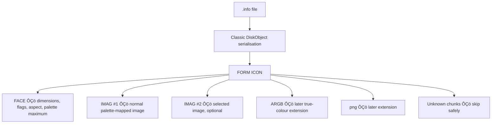
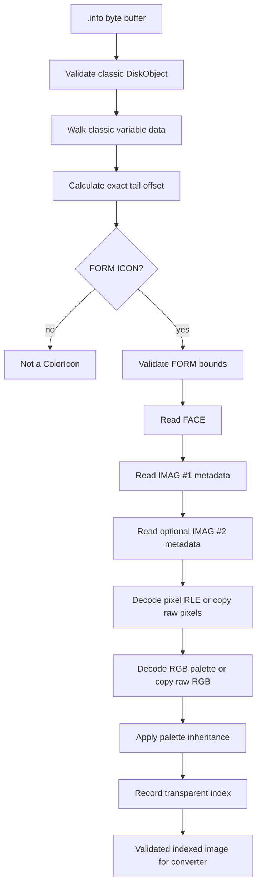

# AmigaOS 3.5/3.9 ColorIcon `FORM ICON` format for a standalone iTidy decoder

## Executive summary

The AmigaOS 3.5/3.9 **ColorIcon** format is unusually well suited to iTidyÔÇÖs goal. The colour imagery is not dependent on `icon.library` to make sense of it: after the conventional Amiga `.info` representation, a self-contained IFF `FORM ICON` is appended. Its core OS3.5/3.9 representation consists of a `FACE` chunk describing the common dimensions/aspect and one or two `IMAG` chunks containing chunky palette indices plus an RGB palette. The first `IMAG` is the normal image; the second, when present, is the selected image. Current AROS source independently implements this format in `workbench/libs/icon/diskobj35io.c`. ¯êÇfilecite¯êéturn22file0¯êéL2-L2¯êü ¯êÇfilecite¯êéturn23file0¯êéL2-L2¯êü

**The important conclusion for iTidy is that decoding genuine OS3.5/3.9 `IMAG` ColorIcons needs neither V44 `icon.library`, datatypes, zlib nor PNG support.** The compression used for `IMAG` pixels and palettes is a small PackBits-like run-length scheme. It is simple enough for a few dozen lines of C89. AROS includes zlib in this source file only because its modern implementation also understands an `ARGB` extension; zlib is not used for `IMAG`. ¯êÇfilecite¯êéturn22file0¯êéL2-L2¯êü

There is one especially important implementation detail that is easy to get wrong: compressed image data is a **continuous bitstream**. RLE control codes are 8 bits, but pixel values use `Depth` bits. With `Depth < 8`, a control code following pixel data can therefore begin in the middle of a byte. A decoder which treats compressed input as ordinary byte-aligned PackBits will only work reliably at depth 8. AROS's `Decode35()` explicitly maintains a bit reservoir to handle this. ¯êÇfilecite¯êéturn22file0¯êéL2-L2¯êü

The on-disk format, reduced to its essentials, is:

```text
classic .info serialisation
        |
        | exact end calculated by parsing classic DiskObject data
        v
+-------------------+
| FORM              |
| BE32 form_size    |
| "ICON"            |
|                   |
|  FACE             |  6-byte payload
|                   |
|  IMAG             |  normal colour image
|                   |
|  IMAG             |  selected image, optional
|                   |
|  later extensions |  ARGB, "png ", unknown chunks
+-------------------+
```

The V44 API documentation independently confirms the logical model exposed by the original library: palette-mapped images are one byte per pixel after decoding, have 1ÔÇô256 colours, dimensions of 1ÔÇô256 pixels in either axis, separate normal/alternate images, an optional transparent palette index, and access to the palette as originally created. It also distinguishes original second-image data from an alternate image which `icon.library` may synthesise itself. ¯êÇcite¯êéturn10view0¯êü

For iTidy I recommend a **strict decoder** with these rules:

| Decision | Recommended iTidy behaviour |
|---|---|
| Find ColorIcon | Parse the classic `.info` first; require `FORM....ICON` at the calculated end |
| Search arbitrarily for `FORM` | **No** in normal operation |
| Core chunks required | one `FACE`, at least one valid `IMAG` |
| Number of `IMAG` chunks | one or two |
| Unknown IFF chunks | skip safely |
| `ARGB` / `png ` | recognise as later extensions; skip for phase one |
| Image compression | format `0` raw, `1` ColorIcon RLE |
| Palette compression | format `0` raw, `1` same RLE with 8-bit entries |
| Palette channels | 8-bit `R,G,B` triples |
| Transparency | honour `IMAG.Flags bit 0`; absent means opaque |
| Second-image palette absent | inherit palette from first image, matching AROS |
| Remapping | **none during decoding**; retain original RGB palette |
| 68000 unaligned reads | never cast file pointers to `UWORD *`/`ULONG *`; read bytes explicitly |

The current official AROS repository is the active upstream source tree, and AROS's own developer documentation identifies GitHub as its central repository. ¯êÇcite¯êéturn8search0¯êéturn8search1¯êü

## File boundary and container structure

### The boundary is not a fixed file offset

There are two boundaries worth distinguishing.

The **fixed serialized `DiskObject` header** is 78 bytes. AROS's `DiskObjectDesc` and `GadgetDesc` explicitly describe the on-disk fields; pointer-valued members are represented in the file as four-byte presence values, not host pointers. After that fixed 78-byte region come variable-size classic icon structures in a defined order. ¯êÇfilecite¯êéturn24file0¯êéL2-L2¯êü

The fixed part works out as:

| Serialized component | Bytes | Running total |
|---|---:|---:|
| `do_Magic`, `do_Version` | 4 | 4 |
| embedded `Gadget` representation | 44 | 48 |
| `do_Type` + pad | 2 | 50 |
| DefaultTool presence | 4 | 54 |
| ToolTypes presence | 4 | 58 |
| `do_CurrentX` | 4 | 62 |
| `do_CurrentY` | 4 | 66 |
| DrawerData presence | 4 | 70 |
| ToolWindow presence | 4 | 74 |
| `do_StackSize` | 4 | **78** |

But **byte 78 is not normally the start of `FORM ICON`**. AROS proceeds from that fixed structure through DrawerData, conventional planar images, strings, ToolTypes and the newer DrawerData fields; only then does `ProcessIcon35` invoke `ReadIcon35()` at the stream's current position. `ReadIcon35()` explicitly records that current position as where its ÔÇ£extra dataÔÇØ begins. ¯êÇfilecite¯êéturn24file0¯êéL2-L2¯êü ¯êÇfilecite¯êéturn25file0¯êéL2-L2¯êü ¯êÇfilecite¯êéturn23file0¯êéL2-L2¯êü

The relevant serialization order in AROS is:

```text
78-byte DiskObject
    |
    +-- old DrawerData, when present
    |
    +-- conventional GadgetRender Image, when present
    |
    +-- conventional SelectRender Image, when present
    |
    +-- DefaultTool, when present
    |
    +-- ToolTypes table, when present
    |
    +-- ToolWindow, when present
    |
    +-- revision-dependent extended DrawerData
    |
    +-- <<< EXACT COLORICON TAIL BOUNDARY >>>
            FORM ICON ...
```

This order follows `IconDesc` in `diskobjio.c`: `ProcessOldDrawerData`, `ProcessGadgetRender`, `ProcessSelectRender`, `ProcessDefaultTool`, `ProcessToolTypes`, `ProcessToolWindow`, `ProcessNewDrawerData`, then `ProcessIcon35`. ¯êÇfilecite¯êéturn24file0¯êéL2-L2¯êü

For the conventional planar `Image`, the serialized image header is 20 bytes. Its pixel-data size is:

```text
((width + 15) >> 4) * height * depth * 2
```

which corresponds to 16-pixel word alignment per row per bitplane. AROS's `ReadImage()` uses exactly this calculation. ¯êÇfilecite¯êéturn25file0¯êéL2-L2¯êü

Strings are stored as a big-endian 32-bit length followed immediately by that many string bytes. ToolTypes begin with a 32-bit value representing the serialized four-byte pointer-table size; AROS derives the number of strings as `(count >> 2) - 1`, then reads each as another length-prefixed string. ¯êÇfilecite¯êéturn25file0¯êéL2-L2¯êü

For a drawer using the supported Workbench disk revision, AROS reads an additional `ULONG dd_Flags` followed by `UWORD dd_ViewModes`, i.e. six bytes, before it reaches `ProcessIcon35`. ¯êÇfilecite¯êéturn25file0¯êéL2-L2¯êü

### A boundary walker suitable for iTidy

In schematic C-like form:

```c
pos = 78;

/* The decisions here should be the same ones already used
 * by iTidy's classic .info parser.
 */

if (has_drawer_data)
    pos += 56;              /* old DrawerData */

if (has_normal_planar_image)
    pos += 20 + classic_planar_bytes(normal);

if (has_selected_planar_image)
    pos += 20 + classic_planar_bytes(selected);

if (has_default_tool)
    pos = skip_be32_length_string(file, len, pos);

if (has_tooltypes)
    pos = skip_tooltypes(file, len, pos);

if (has_tool_window)
    pos = skip_be32_length_string(file, len, pos);

if (has_drawer_data && disk_revision_is_extended)
    pos += 6;

/* pos is now the canonical ColorIcon-tail boundary. */
```

AROS has two compatibility nuances worth retaining if iTidy wants the same boundary decisions as `icon.library`: it may read a normal image if either the serialized render pointer is present **or** `GFLG_GADGIMAGE` says an image is used, and similarly considers the selected-image gadget flags as well as the `SelectRender` presence value. ¯êÇfilecite¯êéturn25file0¯êéL2-L2¯êü

### Safe `FORM ICON` detection

At the calculated boundary, require at least 12 bytes:

```text
offset +0   46 4F 52 4D     "FORM"
offset +4   ss ss ss ss     big-endian FORM ckSize
offset +8   49 43 4F 4E     "ICON"
```

The IFF `FORM` size is a 32-bit big-endian quantity. Child chunks each have an eight-byte `ID + size` header, and odd child payloads are followed by one padding byte so the **next child chunk** is word-aligned within the IFF stream. `icontool` performs precisely the `8 + chunk_size + (chunk_size & 1)` advancement. ¯êÇcite¯êéturn14view1¯êü

I recommend substantially stricter detection than current `icontool`. `icontool` first calculates the end of the traditional structures but then searches forward from there for any `"FORM"` whose form type is `"ICON"`. That avoids mistaking a ToolType such as `FORMAT=...` for the extension, but it can still resynchronise onto a later accidental or malicious byte sequence. ¯êÇcite¯êéturn13view3¯êéturn14view0¯êü

For iTidy:

```text
STRICT:
    classic_end must point exactly at "FORM"

RECOVERY / diagnostic mode only:
    search forward for FORM ICON
    but require a completely valid bounded FORM,
    FACE, and at least one structurally valid IMAG;
    mark it non-canonical.
```

That eliminates false positives without sacrificing a possible future repair mode.

### Endianness and the 68000 alignment trap

All multi-byte quantities in these serialized structures should be interpreted in Motorola/big-endian order. This is also how AROS explicitly handles fields such as the `IMAG` length bytes and later ARGB sizes, and `icontool` uses `>H` and `>I` throughout. ¯êÇfilecite¯êéturn22file0¯êéL2-L2¯êü ¯êÇcite¯êéturn13view1¯êü

However, **do not exploit the fact that the 68000 itself is big-endian by casting pointers into the file buffer**.

The classic string representations are not padded by AROS's serializer before `WriteIcon35()` is reached; `WriteIcon35()` then immediately starts writing the IFF. Thus, by inspection of the serialization path, a `FORM ICON` should not be assumed to have an even *absolute* address in a memory buffer. That means code like:

```c
size = *((ULONG *)(p + 4));     /* unsafe */
```

is inappropriate on a 68000 if `p` may be odd. This is an inference from the AROS serialization path rather than an explicit AmigaOS format statement. ¯êÇfilecite¯êéturn25file0¯êéL2-L2¯êü ¯êÇfilecite¯êéturn26file0¯êéL2-L2¯êü

Use:

```c
static UWORD ci_be16(const UBYTE *p)
{
    return ((UWORD)p[0] << 8) | p[1];
}

static ULONG ci_be32(const UBYTE *p)
{
    return ((ULONG)p[0] << 24) |
           ((ULONG)p[1] << 16) |
           ((ULONG)p[2] << 8)  |
            (ULONG)p[3];
}
```

This is portable, alignment-safe and cheap relative to the amount of image decoding involved.

### Chunk hierarchy

The current AROS ColorIcon reader recognises `FACE`, `IMAG`, `ARGB`, and lower-case `png ` chunks inside `FORM ICON`. The original palette-mapped ColorIcon path is `FACE` plus `IMAG`; the latter two are later true-colour/image extensions and are not required to decode an OS3.5/3.9 palette ColorIcon. ¯êÇfilecite¯êéturn22file0¯êéL2-L2¯êü ¯êÇfilecite¯êéturn23file0¯êéL2-L2¯êü



For the **phase-one iTidy decoder**, I would define ÔÇ£ColorIcon successfully decodedÔÇØ as:

> valid `FORM ICON` + valid `FACE` + at least one valid `IMAG`.

A `FORM ICON` containing only ARGB/PNG imagery should be identified as a later unsupported extension rather than accidentally classified as a decoded OS3.5 ColorIcon.

A useful high-level comparison is:

| Property | Classic | NewIcons | OS3.5/3.9 ColorIcon |
|---|---|---|---|
| Colour image location | ordinary `Image` | ToolTypes (`IM1=`, `IM2=`) | appended `FORM ICON` |
| Pixel representation | planar bitplanes | indexed/chunky after decoding | indexed/chunky after decoding |
| RGB palette stored | no | yes | yes |
| Decoded pixel size | bitplanes | 1 byte/index | 1 byte/index |
| Normal/selected | classic image structures | IM1 / IM2 | first / second `IMAG` |
| Core compression | none | NewIcons encoding | compact bit-RLE |
| Needs modern library to decode manually | no | no | **no** |

The V44 `IconControlA()` contract confirms that palette-mapped icon image data is exposed as one `UBYTE` per pixel, with exactly `width ├ù height` image bytes after decoding, and palettes of 1ÔÇô256 entries. ¯êÇcite¯êéturn10view0¯êü

## FACE and IMAG byte-level specification

### `FACE`

AROS defines the file representation as exactly six bytes:

```c
struct FileFaceChunk
{
    UBYTE Width;
    UBYTE Height;
    UBYTE Flags;
    UBYTE Aspect;
    UBYTE MaxPaletteBytes[2];
};
```

and its writer stores actual width and height minus one. ¯êÇfilecite¯êéturn22file0¯êéL2-L2¯êü ¯êÇfilecite¯êéturn26file0¯êéL2-L2¯êü

| Offset | Size | Field | Meaning |
|---:|---:|---|---|
| `0` | 1 | Width | image width  1 |
| `1` | 1 | Height | image height  1 |
| `2` | 1 | Flags | bit 0 = frameless |
| `3` | 1 | Aspect | packed pixel/icon aspect |
| `4` | 2 | MaxPaletteBytes | BE16 maximum RGB palette byte count  1 |

Thus:

```c
width  = face[0] + 1;      /* 1..256 */
height = face[1] + 1;      /* 1..256 */

max_palette_bytes =
    (((UWORD)face[4] << 8) | face[5]) + 1;
```

The V44 API independently constrains palette-mapped icon width and height to 1ÔÇô256. ¯êÇcite¯êéturn10view0¯êü

AROS defines `ICON35F_FRAMELESS` as bit 0. Unknown higher bits should be ignored for rendering conversion but retained as metadata if iTidy later rewrites ColorIcons. ¯êÇfilecite¯êéturn27file0¯êéL2-L2¯êü

`Aspect` uses a packed numerator/denominator: the numerator occupies the upper nibble and denominator the lower nibble. Zero means unknown. AROS's public header defines:

```c
PACK_ICON_ASPECT_RATIO(num, den) = (num << 4) | den
```

and the V44 autodoc describes the same one-byte packed aspect concept. ¯êÇfilecite¯êéturn21file0¯êéL2-L2¯êü ¯êÇcite¯êéturn10view0¯êü

`MaxPaletteBytes` is an advisory maximum, not the palette itself. AROS's writer computes the larger palette size used by the stored images, multiplies the number of entries by three, subtracts one, then stores that value big-endian. The reader does not rely on this value to decode an `IMAG`. ¯êÇfilecite¯êéturn26file0¯êéL2-L2¯êü

### `IMAG`

The fixed `IMAG` header is ten bytes:

```c
struct FileImageChunk
{
    UBYTE TransparentColor;
    UBYTE NumColors;
    UBYTE Flags;
    UBYTE ImageFormat;
    UBYTE PaletteFormat;
    UBYTE Depth;
    UBYTE NumImageBytes[2];
    UBYTE NumPaletteBytes[2];
};
```

This definition and interpretation are directly implemented by AROS `ReadImage35()`, and `icontool` independently parses the same ten fields. ¯êÇfilecite¯êéturn22file0¯êéL2-L2¯êü ¯êÇcite¯êéturn13view1¯êü

| Offset | Size | Field | Canonical interpretation |
|---:|---:|---|---|
| `0` | 1 | `TransparentColor` | transparent palette index when flag bit 0 is set |
| `1` | 1 | `NumColors` | number of palette entries  1 |
| `2` | 1 | `Flags` | bit 0 transparent index present; bit 1 palette present |
| `3` | 1 | `ImageFormat` | `0` raw; `1` ColorIcon RLE |
| `4` | 1 | `PaletteFormat` | `0` raw RGB; `1` ColorIcon RLE |
| `5` | 1 | `Depth` | bits per encoded pixel value in compressed stream |
| `6` | 2 | `NumImageBytes` | BE16 encoded image byte count  1 |
| `8` | 2 | `NumPaletteBytes` | BE16 encoded palette byte count  1 |
| `10...` | variable | image stream | pixel data first |
| following | variable | palette stream | present only when flag bit 1 is set |

AROS defines the flag bits as:

```c
#define IMAGE35F_HASTRANSPARENTCOLOR 1
#define IMAGE35F_HASPALETTE          2
```

¯êÇfilecite¯êéturn27file0¯êéL2-L2¯êü

The sizes are reconstructed as:

```c
num_colours = (UWORD)h[1] + 1;

image_bytes =
    (((ULONG)h[6] << 8) | h[7]) + 1;

if (h[2] & 2)
    palette_bytes =
        (((ULONG)h[8] << 8) | h[9]) + 1;
else
    palette_bytes = 0;
```

AROS implements those exact `+1` calculations. ¯êÇfilecite¯êéturn22file0¯êéL2-L2¯êü

### Raw image representation

When `ImageFormat == 0`, the image is **not packed according to `Depth`**. AROS simply copies `width ├ù height` bytes from the stream into the chunky pixel array. In other words, even a two-colour uncompressed image uses one byte per pixel. ¯êÇfilecite¯êéturn22file0¯êéL2-L2¯êü

For iTidy, make this stricter than AROS's present code:

```text
if ImageFormat == 0:
    require image_bytes == width * height
```

AROS currently performs the copy without first proving that the declared raw image area is that large, so this is a worthwhile hardening improvement rather than behaviour to imitate. ¯êÇfilecite¯êéturn22file0¯êéL2-L2¯êü

### Raw palette representation

When a palette exists and `PaletteFormat == 0`, AROS reads three bytes for each palette entry in this exact order:

```text
R G B
R G B
R G B
...
```

Each component is eight bits. ¯êÇfilecite¯êéturn22file0¯êéL2-L2¯êü

Therefore a canonical uncompressed palette should have:

```text
palette_bytes == num_colours * 3
```

The V44 API describes the retrieved palette as the palette corresponding to the colours in use when the icon was created, with a palette size up to 256 entries. ¯êÇcite¯êéturn10view0¯êü

### Normal and selected imagery

There is **no explicit normal/selected field in `IMAG`**.

AROS assigns the first successfully decoded `IMAG` to `ni_Image[0]` and the second to `ni_Image[1]`. Thus chunk order supplies the state mapping:

```text
first IMAG  -> normal
second IMAG -> selected
```

¯êÇfilecite¯êéturn23file0¯êéL2-L2¯êü

If the second `IMAG` has no palette of its own, AROS assigns it the first image's palette and pen count. This palette inheritance is important and should be reproduced by iTidy. ¯êÇfilecite¯êéturn23file0¯êéL2-L2¯êü

So:

```text
IMAG #1:
    palette required in practice for standalone RGB reconstruction

IMAG #2:
    own palette if HASPALETTE
    otherwise inherit palette #1
```

Do **not** fabricate Workbench colours when a required source palette is genuinely unavailable. Current `icontool` does fabricate default WB palettes in such a situation; that is convenient for image export but is not a faithful reconstruction of the ColorIcon data. ¯êÇcite¯êéturn14view0¯êü

When there is no stored second `IMAG`, iTidy should report ÔÇ£selected image not storedÔÇØ. Original V44 `icon.library` could generate an alternate image itself, and `ICONCTRLA_HasRealImage2` exists specifically to distinguish a genuinely stored second image from one generated by the library. ¯êÇcite¯êéturn10view0¯êü

### Transparency

The logical interpretation should be:

```c
if (flags & IMAGE35F_HASTRANSPARENTCOLOR)
    transparent_index = TransparentColor;
else
    transparent_index = -1;
```

The V44 public API uses exactly this model: a palette index identifies the transparent colour, while `-1` represents an opaque image. It also requires the transparent index to be within the palette. ¯êÇcite¯êéturn10view0¯êü

There is a notable **AROS implementation anomaly** here. Its internal header clearly defines bit 0 as `HASTRANSPARENTCOLOR`, but current `ReadIcon35()` copies `ic.TransparentColor` into the native structure without testing the flag; current `WriteImage35()` also appears internally inconsistent, setting the flag for a non-negative transparent index and then writing `255` when that flag is set. I would treat these current-source details as bugs or compatibility artefacts, not as the semantic specification. ¯êÇfilecite¯êéturn23file0¯êéL2-L2¯êü ¯êÇfilecite¯êéturn26file0¯êéL2-L2¯êü

For iTidy, the flag plus V44 API semantics are the safer rule.

### `ARGB` and `png `

Current AROS also accepts `ARGB` and `png ` chunk IDs within `FORM ICON`. This is useful for recognising a later icon without misunderstanding it as `IMAG`, but neither needs implementation for the OS3.5/3.9 palette decoder. ¯êÇfilecite¯êéturn22file0¯êéL2-L2¯êü ¯êÇfilecite¯êéturn23file0¯êéL2-L2¯êü

Current AROS's `ARGB` implementation expects:

```text
offset  size   meaning
0       4      ztype, BE32; writer sets 1
4       4      compressed size, BE32
8       2      reserved, writer sets 0
10      ...    zlib-compressed ARGB pixels
```

Dimensions come from `FACE`; expected decompressed length is `width ├ù height ├ù 4`. ¯êÇfilecite¯êéturn22file0¯êéL2-L2¯êü

That path invokes zlib `uncompress()`. **The `IMAG` path does not.** Therefore iTidy can simply recognise and skip `ARGB` without bringing any zlib dependency into a WB2.xÔÇô3.1 build. ¯êÇfilecite¯êéturn22file0¯êéL2-L2¯êü

Current `icontool` disagrees materially about `ARGB`: its `parse_argb_chunk()` reads two big-endian 16-bit dimensions followed by uncompressed ARGB bytes. ¯êÇcite¯êéturn13view2¯êü This divergence is another reason not to let ARGB work dilute the ColorIcon phase. It needs separate research before implementation.

## Compression, palette reconstruction and worked bytes

### The exact `IMAG` compression

AROS comments that `Decode35()` was based on Dirk St├Âcker's `ModifyIcon`. Its decoder takes:

```text
compressed byte stream
output byte array
compressed input length
bits per entry
required number of output entries
```

and uses the same routine for both pixels and palettes. For pixels, `bits = Depth`; for a compressed palette, `bits = 8` and the expected number of entries is `3 ├ù num_colours`. ¯êÇfilecite¯êéturn22file0¯êéL2-L2¯êü

The control semantics are:

| Control | Operation |
|---|---|
| `00..7F` | copy the following `control + 1` entries literally |
| `80` | no-op |
| `81..FF` | repeat the following single entry `257 - control` times |

Examples:

```text
00 -> 1 literal entry
03 -> 4 literal entries
7F -> 128 literal entries

81 -> repeat next entry 128 times
FD -> repeat next entry 4 times
FE -> repeat next entry 3 times
FF -> repeat next entry 2 times

80 -> no-op
```

This follows AROS's exact branches: `<=127` means literal; `>128` means repeat; exactly `128` continues without consuming an entry. ¯êÇfilecite¯êéturn22file0¯êéL2-L2¯êü

### The subtle bit-packing rule

After a control code, image values occupy only `Depth` bits each. All bits are consumed most-significant-bit first from **one continuous stream**.

Consider `Depth = 2`:

```text
03 1B
```

in binary:

```text
00000011 00011011
^^^^^^^^
control 03 = four literals

         00 01 10 11
         ^  ^  ^  ^
         0  1  2  3
```

So this expands to:

```text
00 01 02 03
```

With other depths, the literal/repeated values need not end on a byte boundary. The **next control byte is read from the next eight bits of that same stream**, wherever those bits begin. AROS's `bitbuf/numbits` logic is specifically written that way. ¯êÇfilecite¯êéturn22file0¯êéL2-L2¯êü

This is the most important decoder detail in the report.

### Safe C89 decompressor pseudocode

For iTidy's first implementation, I would favour a deliberately simple bit reader over AROS's more compact bit-reservoir code. Icons are small enough that correctness and bounded reads matter more than shaving a few shifts.

```c
typedef struct
{
    const UBYTE *data;
    ULONG        size;       /* bytes */
    ULONG        bit_pos;    /* next bit */
} CIBitReader;

static BOOL
ci_read_bits(CIBitReader *br, UWORD bits, UWORD *value)
{
    UWORD v = 0;
    UWORD i;

    if (bits == 0 || bits > 8)
        return FALSE;

    /* Avoid size * 8 overflow by comparing quotient/remainder. */
    for (i = 0; i < bits; ++i)
    {
        ULONG byte_pos;
        UWORD bit_in_byte;
        UBYTE b;

        byte_pos = br->bit_pos >> 3;

        if (byte_pos >= br->size)
            return FALSE;

        bit_in_byte = (UWORD)(7 - (br->bit_pos & 7));
        b = br->data[byte_pos];

        v = (UWORD)((v << 1) | ((b >> bit_in_byte) & 1));

        ++br->bit_pos;
    }

    *value = v;
    return TRUE;
}
```

The decompressor can then be:

```c
static CIStatus
ci_rle_decode(const UBYTE *src,
              ULONG src_bytes,
              UWORD bits,
              UBYTE *dst,
              ULONG expected_entries)
{
    CIBitReader br;
    ULONG out = 0;

    if (!src || !dst)
        return CI_BAD_ARGUMENT;

    if (bits < 1 || bits > 8)
        return CI_BAD_DEPTH;

    br.data = src;
    br.size = src_bytes;
    br.bit_pos = 0;

    while (out < expected_entries)
    {
        UWORD control;

        if (!ci_read_bits(&br, 8, &control))
            return CI_TRUNCATED_RLE;

        if (control <= 0x7F)
        {
            ULONG count = (ULONG)control + 1;
            ULONG i;

            if (count > expected_entries - out)
                return CI_RLE_OUTPUT_OVERRUN;

            for (i = 0; i < count; ++i)
            {
                UWORD value;

                if (!ci_read_bits(&br, bits, &value))
                    return CI_TRUNCATED_RLE;

                dst[out++] = (UBYTE)value;
            }
        }
        else if (control == 0x80)
        {
            /* Explicit no-op. */
        }
        else
        {
            ULONG count = 257UL - (ULONG)control;
            UWORD value;
            ULONG i;

            if (count > expected_entries - out)
                return CI_RLE_OUTPUT_OVERRUN;

            if (!ci_read_bits(&br, bits, &value))
                return CI_TRUNCATED_RLE;

            for (i = 0; i < count; ++i)
                dst[out++] = (UBYTE)value;
        }
    }

    /*
     * Do not demand exact consumption of every bit:
     * final byte padding may remain.
     */
    return CI_OK;
}
```

That algorithm deliberately differs from `icontool` at `0x80`. `icontool` currently treats all values `>= 128` as repeat commands in its byte-oriented palette routine, and sign-extends `0x80` to `-128` in its general bit-packed routine, effectively interpreting it as a repeat of 129. AROS explicitly treats `0x80` as a no-op. For iTidy, AROS is the stronger reference here. ¯êÇcite¯êéturn13view0¯êéturn14view1¯êü ¯êÇfilecite¯êéturn22file0¯êéL2-L2¯êü

### Palette reconstruction

There should be **no screen remapping at decode time**.

The output of the ColorIcon decoder should be the original indexed pixels and original 24-bit palette:

```c
palette[0] = { R0, G0, B0 };
palette[1] = { R1, G1, B1 };
...
```

The V44 API distinguishes that source palette from the later remapping of palette-mapped icons to a screen. `IconControlA()` says the retrieved palette has the number of entries used when the icon was created, while global precision/screen controls govern remapping for display. ¯êÇcite¯êéturn10view0¯êü

That distinction fits iTidy perfectly:

```text
ColorIcon decoder
      |
      v
source palette + source indices
      |
      v
iTidy conversion stage
      |
      v
map source RGB colours to WB2.x/3.1 target pens
```

Do not try to reproduce V44's `ObtainBestPen()` decisions inside the decoder.

For an uncompressed palette:

```c
for (i = 0; i < num_colours; ++i)
{
    rgb[i][0] = pal[i * 3 + 0];  /* R */
    rgb[i][1] = pal[i * 3 + 1];  /* G */
    rgb[i][2] = pal[i * 3 + 2];  /* B */
}
```

For a compressed palette, run the same RLE engine with:

```text
bits             = 8
expected_entries = num_colours * 3
```

then interpret the result as those same RGB triples. AROS does exactly this. ¯êÇfilecite¯êéturn22file0¯êéL2-L2¯êü

### Minimal raw ColorIcon example

This is a complete **synthetic `FORM ICON` tail**, not an entire `.info`. It represents a 2×2, two-colour, opaque image:

```text
46 4F 52 4D 00 00 00 2E 49 43 4F 4E
46 41 43 45 00 00 00 06
01 01 00 00 00 05
49 4D 41 47 00 00 00 14
00 01 02 00 00 01 00 03 00 05
00 01 01 00
00 00 00 FF FF FF
```

Breakdown:

```text
46 4F 52 4D      "FORM"
00 00 00 2E      FORM payload size = 46
49 43 4F 4E      "ICON"

46 41 43 45      "FACE"
00 00 00 06      FACE size = 6

01                width - 1  -> 2
01                height - 1 -> 2
00                flags
00                aspect unknown
00 05             max palette bytes - 1 -> 6 bytes

49 4D 41 47      "IMAG"
00 00 00 14      payload = 20 bytes

00                transparent index field, ignored: flag not set
01                colours - 1 -> 2 colours
02                HASPALETTE
00                raw image
00                raw palette
01                depth = 1
00 03             image bytes - 1 -> 4 bytes
00 05             palette bytes - 1 -> 6 bytes

00 01 01 00      2x2 pixel indices

00 00 00          palette[0] black
FF FF FF          palette[1] white
```

Although `Depth` is 1, the uncompressed image still contains **four full bytes**, one for each pixel, matching AROS's raw path. ¯êÇfilecite¯êéturn22file0¯êéL2-L2¯êü

To make palette entry 0 transparent, only the `IMAG` header changes:

```text
transparent = 00
flags       = 03     ; HAS_TRANSPARENT | HAS_PALETTE
```

### Minimal compressed-pixel example

A 4×1 image containing indices `0,1,2,3`, at depth 2, can encode its complete image stream in two bytes:

```text
03 1B
```

because:

```text
03 = literal count 4
1B = 00 01 10 11 = values 0,1,2,3
```

A matching `IMAG` fixed header could be:

```text
00 03 02 01 00 02 00 01 00 0B
```

meaning:

```text
00       no meaningful transparent index
03       four colours
02       HASPALETTE
01       compressed image
00       raw palette
02       2 bits/index
00 01    two encoded image bytes
00 0B    twelve raw palette bytes
```

A complete synthetic tail could therefore be:

```text
46 4F 52 4D 00 00 00 32 49 43 4F 4E
46 41 43 45 00 00 00 06
03 00 00 00 00 0B
49 4D 41 47 00 00 00 18
00 03 02 01 00 02 00 01 00 0B
03 1B
00 00 00
FF 00 00
00 FF 00
FF FF FF
```

Expected output:

```text
width       = 4
height      = 1
colours     = 4
pixels      = 00 01 02 03
palette[0]  = 00 00 00
palette[1]  = FF 00 00
palette[2]  = 00 FF 00
palette[3]  = FF FF FF
```

### Repeat and compressed-palette examples

At one bit per entry:

```text
FD 00
```

means:

```text
FD = repeat next value 257 - 253 = 4 times
0  = next 1-bit value
remaining seven bits of the final byte are padding
```

and therefore expands to:

```text
00 00 00 00
```

For a two-colour black/white palette, the uncompressed bytes:

```text
00 00 00 FF FF FF
```

can be represented, at eight bits per RLE entry, as:

```text
FE 00 FE FF
```

because each `FE` requests three copies of the following byte.

These are valuable tiny golden vectors for an iTidy unit-test harness because they exercise literal runs, repeat runs, arbitrary image depth and compressed palettes independently.

## AROS and `icontool` cross-reference

AROS is particularly valuable here because it does not merely expose the V44 API; it has to independently interpret the file representation. The official AROS project describes its GitHub repository as its central source tree. ¯êÇcite¯êéturn8search0¯êéturn8search1¯êü

### AROS source map

| Requirement | AROS file/function | What it establishes |
|---|---|---|
| fixed classic serialization | `diskobjio.c` ÔÇö `GadgetDesc`, `DiskObjectDesc`, `ImageDesc` | exact serialized field ordering |
| variable classic ordering | `diskobjio.c` ÔÇö `IconDesc` | exact point at which ColorIcon parsing starts |
| classic planar image size | `diskobjio.c` ÔÇö `ReadImage()` | planar byte calculation |
| `FACE` / `IMAG` structs | `diskobj35io.c` ÔÇö `FileFaceChunk`, `FileImageChunk` | exact field sizes/order |
| flags | `icon_intern.h` | transparent, palette, frameless bits |
| RLE decoder | `diskobj35io.c` ÔÇö `Decode35()` | exact control and bitstream semantics |
| palette/pixels | `diskobj35io.c` ÔÇö `ReadImage35()` | raw versus packed image; RGB palette |
| first/second image | `diskobj35io.c` ÔÇö `ReadIcon35()` | normal/select ordering |
| palette inheritance | `diskobj35io.c` ÔÇö `ReadIcon35()` | selected image can share first palette |
| encoder cross-check | `Encode35()`, `WriteImage35()` | inverse RLE and size-minus-one fields |
| FACE writer | `WriteIcon35()` | width/height1, maximum palette bytes1 |
| later ARGB | `ReadARGB35()`, `WriteARGB35()` | separate zlib-dependent extension |

All of those are present in current upstream AROS source. ¯êÇfilecite¯êéturn22file0¯êéL2-L2¯êü ¯êÇfilecite¯êéturn23file0¯êéL2-L2¯êü ¯êÇfilecite¯êéturn24file0¯êéL2-L2¯êü ¯êÇfilecite¯êéturn25file0¯êéL2-L2¯êü ¯êÇfilecite¯êéturn26file0¯êéL2-L2¯êü ¯êÇfilecite¯êéturn27file0¯êéL2-L2¯êü

The most confidence-inspiring aspect is that AROS has both decoder and encoder. `Decode35()` and `Encode35()` are inverse implementations of the same bit-packed RLE; `WriteImage35()` writes the size-minus-one fields and `ReadImage35()` adds one when reconstructing them. ¯êÇfilecite¯êéturn22file0¯êéL2-L2¯êü ¯êÇfilecite¯êéturn23file0¯êéL2-L2¯êü ¯êÇfilecite¯êéturn26file0¯êéL2-L2¯êü

### V44 documentation cross-check

The original V44 `IconControlA()` contract does not document the private `FORM ICON` bytes, but it independently verifies the decoded data model:

- palette mapped image;
- width and height 1ÔÇô256;
- palette 1ÔÇô256;
- one byte of image data per pixel;
- original RGB palette accessible;
- separate transparent index for each image, with `-1` meaning opaque;
- regular and alternate image data;
- aspect information;
- frameless property;
- an alternate image may be generated when none is physically stored. ¯êÇcite¯êéturn10view0¯êü

This is important because it means the AROS file parser produces exactly the type of object the V44 public API says should exist.

The V44 write API also explicitly distinguishes preserving/dropping traditional planar icon imagery from preserving/dropping the chunky palette-mapped imagery. That corroborates the architectural model of a traditional icon plus an additional colour representation. ¯êÇcite¯êéturn10view1¯êü

### `icontool` source map

Current `icontool` is a useful independent implementation because its parser is deliberately independent of Amiga `icon.library`:

| Function | Role |
|---|---|
| `parse_icon_file()` | walks the traditional `.info` structures |
| `find_glowicons_form()` | locates `FORM....ICON` after classic data |
| `parse_glowicons()` | walks IFF child chunks and word padding |
| `parse_imag_chunk()` | decodes ten-byte `IMAG` header |
| `unpack_rle_bitpacked()` | bit-packed pixel RLE |
| `unpack_rle_8bit()` | palette/depth-8 RLE |
| `parse_argb_chunk()` | later ARGB interpretation |

`parse_imag_chunk()` agrees with AROS on the ten-byte header, byte order, image-first/palette-second order, colour-count `+1`, depth, and size `+1`. ¯êÇcite¯êéturn13view1¯êü

`parse_glowicons()` agrees on `FORM ICON`, `FACE`, ordered image chunks and IFF word padding. ¯êÇcite¯êéturn14view1¯êü

### Where the implementations diverge

This comparison is more useful than blindly translating either codebase.

| Subject | AROS | `icontool` | iTidy recommendation |
|---|---|---|---|
| FORM location | starts parsing at exact extra-data boundary | scans forward from calculated boundary | **require exact boundary** |
| `FACE` bytes | reads all 6 | uses first 4 | **read all 6** |
| `0x80` RLE control | no-op | interpreted as repeat 129 | **follow AROS: no-op** |
| palette-present flag | honours bit 1 | primarily infers palette from size | **honour bit 1** |
| absent selected palette | inherits image 1 palette | creates fallback palette | **inherit image 1** |
| missing source palette | leaves no palette | invents WB/default palette | **do not invent RGB** |
| transparency | flag defined, but current reader does not consistently honour it | honours bit 0 | **flag controls transparency** |
| unknown compression value | any nonzero treated packed | boolean treatment | **accept 0/1; reject unknown** |
| ARGB | 10-byte header + zlib, FACE dimensions | raw width/height + ARGB | **do not decode in this phase** |

The `0x80` distinction can be seen directly in `icontool`'s RLE routines versus AROS's `Decode35()`. ¯êÇcite¯êéturn13view0¯êéturn14view1¯êü ¯êÇfilecite¯êéturn22file0¯êéL2-L2¯êü

The selected-palette difference is similarly explicit: AROS assigns `img1pal` to image two if no second palette was loaded, whereas `icontool` substitutes one of its built-in palettes when palette data is unavailable. ¯êÇfilecite¯êéturn23file0¯êéL2-L2¯êü ¯êÇcite¯êéturn14view0¯êü

The ARGB difference is sufficiently large that I would consider that format **unresolved for a future separate study**, not part of ColorIcon implementation. Current `icontool` labels it an ÔÇ£OS4 true-color formatÔÇØ, while current AROS has a different compressed representation. ¯êÇcite¯êéturn13view2¯êü ¯êÇfilecite¯êéturn22file0¯êéL2-L2¯êü

That does not weaken confidence in `IMAG`: on the core OS3.5 ColorIcon fields, AROS and `icontool` agree strongly, and the V44 API agrees with the resulting decoded model.

## Standalone C89 decoder design for iTidy

The cleanest implementation is a **two-stage, almost allocation-free parser**.

First create an in-place view of the `.info` bytes. Only after validation does the caller supply memory for decoded pixels.



### Data structures

I would not expose AROS structures directly. A small iTidy-owned representation isolates the converter from the source format:

```c
typedef enum
{
    CI_OK = 0,
    CI_NOT_COLORICON,
    CI_TRUNCATED,
    CI_BAD_FORM,
    CI_BAD_FACE,
    CI_BAD_IMAG,
    CI_BAD_DEPTH,
    CI_BAD_COMPRESSION,
    CI_BAD_PALETTE,
    CI_BAD_PIXEL_INDEX,
    CI_TRUNCATED_RLE,
    CI_RLE_OUTPUT_OVERRUN,
    CI_UNSUPPORTED_TRUECOLOUR,
    CI_BAD_ARGUMENT
} CIStatus;

typedef struct
{
    UBYTE r;
    UBYTE g;
    UBYTE b;
} CIRGB;

typedef struct
{
    const UBYTE *chunk;       /* in original .info */
    ULONG        chunk_size;

    const UBYTE *image_src;
    ULONG        image_src_size;

    const UBYTE *palette_src;
    ULONG        palette_src_size;

    UWORD        colours;     /* 1..256 */
    UBYTE        depth;       /* 1..8 */
    UBYTE        image_format;
    UBYTE        palette_format;
    UBYTE        flags;

    WORD         transparent; /* -1 if opaque */

    BOOL         has_palette;
} CIImageView;

typedef struct
{
    ULONG        form_offset;
    ULONG        form_size;

    UWORD        width;
    UWORD        height;

    UBYTE        face_flags;
    UBYTE        aspect;

    UWORD        max_palette_bytes;

    UWORD        image_count; /* 1 or 2 */
    CIImageView  image[2];
} CIIconView;
```

The decoded state can remain indexed:

```c
typedef struct
{
    UWORD width;
    UWORD height;
    UWORD colours;

    WORD  transparent;

    UBYTE *pixels;            /* width * height */
    CIRGB *palette;           /* colours entries */
} CIDecodedImage;
```

There is no reason to expand a ColorIcon to RGBA merely to reduce it later to a four-colour Workbench icon. The source index already identifies an RGB palette entry.

### Public functions

A compact API could be:

```c
CIStatus
CI_FindClassicEnd(const UBYTE *file,
                  ULONG file_size,
                  ULONG *classic_end);

CIStatus
CI_ParseColorIcon(const UBYTE *file,
                  ULONG file_size,
                  ULONG classic_end,
                  CIIconView *view);

CIStatus
CI_DecodeImage(const CIIconView *view,
               UWORD image_number,
               UBYTE *pixel_buffer,
               ULONG pixel_buffer_size,
               CIRGB *palette_buffer,
               UWORD palette_capacity,
               CIDecodedImage *decoded);

CIStatus
CI_DecodeRLE(const UBYTE *src,
             ULONG src_size,
             UWORD bits,
             UBYTE *dst,
             ULONG entries);
```

If iTidy's existing classic parser already knows the exact end of classic `.info` data, `CI_FindClassicEnd()` does not need to exist at all. Passing the already-calculated boundary into the ColorIcon module would avoid duplicating sensitive `.info` parsing logic.

### Parsing the `FORM`

The important arithmetic rule is to validate by **subtraction**, rather than performing potentially wrapping additions.

Prefer:

```c
if (offset > file_size)
    fail;

remaining = file_size - offset;

if (remaining < 12)
    fail;
```

rather than:

```c
if (offset + 12 > file_size)   /* can wrap */
```

After reading the FORM size:

```c
form_payload = ci_be32(p + 4);

if (form_payload < 4)
    fail;

if (form_payload > file_size - form_offset - 8)
    fail;

form_end = form_offset + 8 + form_payload;
```

Then each child:

```c
if (form_end - pos < 8)
    fail;

chunk_size = ci_be32(file + pos + 4);
data_pos = pos + 8;

if (chunk_size > form_end - data_pos)
    fail;

/* process */

advance = chunk_size;

if (advance & 1)
{
    if (form_end - data_pos < advance + 1)
        fail;

    ++advance;
}

pos = data_pos + advance;
```

Unknown chunks can be skipped this way without understanding them.

### Strict `IMAG` validation

I recommend:

```text
FACE:
    size >= 6
    dimensions become 1..256 automatically
    exactly one FACE in strict mode

IMAG:
    FACE must already exist
    size >= 10
    no more than two IMAGs
    NumColors + 1 -> 1..256
    Depth -> 1..8
    ImageFormat -> 0 or 1
    PaletteFormat -> 0 or 1 if a palette exists
```

For image data:

```text
raw:
    image_src_size == width * height

compressed:
    run decoder
    require exactly width * height output entries
```

For palette:

```text
HASPALETTE:
    raw -> palette_src_size == colours * 3
    compressed -> decoder must produce exactly colours * 3 bytes

no HASPALETTE:
    first image -> structurally possible but RGB reconstruction unavailable
    second image -> inherit first image's decoded palette
```

Every final pixel index should satisfy:

```c
pixel[i] < effective_palette_entries
```

except that a structurally parsed icon with no available palette may be reported separately rather than interpreted.

### Memory requirements

The V44 dimensions cap the ColorIcon face at 256├ù256, and the palette at 256 entries. ¯êÇcite¯êéturn10view0¯êü

Therefore the decoded indexed representation has very manageable maxima:

| Item | Maximum |
|---|---:|
| one image's pixel indices | `256 × 256` = **65,536 B** |
| one 256-entry RGB palette | `256 × 3` = **768 B** |
| one fully decoded image | **66,304 B** |
| two independent images + two palettes | **132,608 B** |
| RGBA expansion of one max image | 262,144 B ÔÇö best avoided |

The `IMAG` encoded-size fields themselves are 16-bit ÔÇ£size minus oneÔÇØ values, so they can represent 1ÔÇô65,536 encoded bytes. A decoder operating directly on the original `.info` buffer does not need a second copy of those encoded streams. ¯êÇfilecite¯êéturn22file0¯êéL2-L2¯êü

On an A500-class machine, the best conversion strategy is therefore:

```text
.info already in memory
      +
small CIIconView
      +
65,536-byte maximum pixel buffer
      +
768-byte palette
      +
classic output buffer
```

and process normal and selected states sequentially. There is no need to retain both full decoded colour images simultaneously.

For the much more typical 46├ù46 OS3.5-style artwork, the index buffer is only 2,116 bytes. Contemporary ColorIcon sets were not actually limited to that size; for example an Aminet ColorIcon game collection explicitly uses 120├ù96 images. ¯êÇcite¯êéturn16search1¯êü

### An even lower-memory conversion path

Because iTidy ultimately wants a classic four-colour icon, it can eventually avoid keeping the entire decoded chunky image at once.

After the palette is reconstructed and each source palette entry has been assigned a destination WB pen:

```text
source palette index
       |
       v
precomputed map[256]
       |
       v
target WB pen 0..3
```

the RLE decoder could send each decoded index directly to a planar-output builder. That potentially reduces the 65,536-byte worst-case intermediate pixel allocation almost completely.

I would **not** start with that optimisation. First implement and test `CI_DecodeRLE()` into a chunky byte buffer; once golden fixtures pass, adding a callback/output-sink variant is straightforward and much safer.

## Validation, corpus and implementation checklist

### Positive unit-test corpus

The first test corpus should contain deliberately tiny synthetic `.info` files whose `FORM ICON` tails are hand-verifiable. That gives much stronger assurance about the bitstream than starting solely with real 46×46 artwork.

| Suggested fixture | Width × height | Colours | Transparency | Normal | Selected | Purpose |
|---|---:|---:|---|---|---|---|
| `ci_raw_2x2_2c.info` | 2×2 | 2 | none | yes | no | raw image + raw palette |
| `ci_raw_2x2_trans0.info` | 2×2 | 2 | index 0 | yes | no | transparency flag |
| `ci_rle_literal_4x1_d2.info` | 4×1 | 4 | none | yes | no | `03 1B` depth-2 literal |
| `ci_rle_repeat_4x1_d1.info` | 4×1 | 2 | none | yes | no | `FD 00` repeated 1-bit value |
| `ci_rle_nop_1x1.info` | 1×1 | 2 | none | yes | no | explicit `80` before valid run |
| `ci_palrle_2c.info` | 2×2 | 2 | none | yes | no | compressed `FE 00 FE FF` palette |
| `ci_select_sharedpal.info` | 3×2 | 4 | none | yes | yes | image 2 omits palette |
| `ci_select_ownpal.info` | 3×2 | 4 | index 0 | yes | yes | independent state palettes |
| `ci_256x256_256c.info` | 256×256 | 256 | chosen index | yes | yes | maximum dimensions/RAM |

The `ci_rle_nop_1x1.info` fixture is particularly important: it will distinguish an AROS-compatible decoder from the current `icontool` behaviour at control value `0x80`. ¯êÇfilecite¯êéturn22file0¯êéL2-L2¯êü ¯êÇcite¯êéturn13view0¯êü

### Real-world corpus

After synthetic tests, use freely obtainable period ColorIcon archives as integration tests.

`GameIcons5.lha` is unusually useful because its author explicitly states that all icons are in ColorIcon format, all are 120├ù96, each icon has two pictures, and most were made with 256 colours. The archive lists many actual `.info` members, including `Icons/LetterDrawers/small/a/Amegas.info`. ¯êÇcite¯êéturn16search1¯êü

`Lucy35Icons.lha` is another strong regression corpus because its author explicitly says the package contains old NewIcons converted to OS3.5 icons, with more than 60 game icons and a visible list of `.info` members. ¯êÇcite¯êéturn16search3¯êü

For smaller artwork, `Drw-Icn_OS35.lha` contains `Drw-Icn_blue.info` and explicitly requires OS3.5. ¯êÇcite¯êéturn16search5¯êü

A good third corpus is a legally owned AmigaOS 3.5/3.9 installation itself, because that gives you artefacts written by the original H&P/AmigaOS toolchain rather than third-party encoders. The V44 API's behaviour can then be used on an OS3.5/3.9 reference environment once, offline, to build golden metadata: width, height, palette count, transparent index, `HasRealImage2` and hashes of the returned chunky image/palette. The finished iTidy decoder need not call V44 at all; those results become test oracle data. The required V44 queries are documented by `IconControlA()`. ¯êÇcite¯êéturn10view0¯êü

### Malformed-file tests

Security here mostly means never trusting lengths or run counts. At minimum the test suite should mutate:

| Malformation | Expected outcome |
|---|---|
| truncated 78-byte header | reject classic icon |
| bogus classic string length | reject before FORM search |
| classic planar dimensions overflow | reject |
| fake `"FORM"` inside ToolType | do not detect |
| FORM type not `ICON` | not ColorIcon |
| FORM size beyond EOF | reject |
| child chunk header truncated | reject |
| child size beyond FORM end | reject |
| odd child with missing pad byte | reject strict mode |
| `IMAG` before `FACE` | reject/ignore then no valid image |
| `FACE` shorter than 6 | reject |
| `IMAG` shorter than 10 | reject |
| third `IMAG` | reject strict / ignore with warning |
| depth 0 or >8 | reject |
| compression type >1 | unsupported/reject |
| raw image shorter than `w*h` | reject |
| raw palette shorter than `3*n` | reject |
| RLE input ends in literal run | reject |
| RLE input ends before repeat value | reject |
| RLE run exceeds expected output | reject |
| RLE produces too few entries | reject |
| palette index  available colours | reject |
| transparent index  colours | reject |
| second palette omitted | inherit first |
| first palette omitted | report colour reconstruction unavailable |
| only ARGB / `png ` present | unsupported later icon, not decoded ColorIcon |

The reason to reject RLE overshoots rather than silently truncate is particularly important. AROS's decoder stops when the requested output count is reached; that is fine in a trusted system library, but a converter processing arbitrary files gains nothing by accepting contradictory run lengths. ¯êÇfilecite¯êéturn22file0¯êéL2-L2¯êü

### Recommended implementation checklist for iTidy

- [ ] Reuse iTidy's existing classic `.info` parser to calculate the **exact end of traditional icon data**.
- [ ] Require `FORM`, bounded BE32 size and `ICON` at that exact position.
- [ ] Add alignment-safe `be16()` / `be32()` byte readers; never dereference unaligned file words/longs.
- [ ] Walk IFF chunks with odd-size padding and strict FORM bounds.
- [ ] Require a six-byte `FACE`; decode `width+1`, `height+1`, frameless flag, aspect and maximum palette-byte field.
- [ ] Parse one or two ten-byte `IMAG` headers.
- [ ] Implement raw one-byte-per-pixel imagery.
- [ ] Implement the continuous bitstream RLE exactly, including `0x80` as no-op.
- [ ] Decode compressed palettes through the same engine at 8 bits per entry.
- [ ] Preserve palettes as original 8-bit `RGB` triples; do **no Workbench remapping inside the decoder**.
- [ ] Treat transparency as active only when `Flags & 1`; otherwise expose `-1`.
- [ ] Let selected imagery inherit the first palette when `Flags & 2` is absent.
- [ ] Recognise `ARGB` and `png ` as outside this ColorIcon phase and skip them safely.
- [ ] Decode one state at a time to keep worst-case working storage around 66 KB rather than expanding to RGBA.
- [ ] Build the tiny hand-verified fixtures before testing real OS3.5 artwork.
- [ ] Cross-check a sample corpus against original V44 `IconControlA()` on an OS3.5/3.9 reference installation, then freeze those results as golden tests.

The strongest architectural boundary is therefore:

```text
                itidy_coloricon.c

classic_end
     |
     v
FORM ICON parser
     |
     +-- FACE
     |
     +-- IMAG #1 --\
     |              \
     +-- IMAG #2 ----> indexed pixels + original RGB palette
                            |
                            |  no icon.library
                            |  no datatype
                            |  no zlib
                            v
                    iTidy conversion layer
                            |
                            v
                    classic planar icon
```

The next implementation step should stay equally narrow: **write and test the standalone `FORM ICON`/`FACE`/`IMAG` parser and `Decode35`-compatible RLE routine before doing any colour reduction at all**. Once those tests can reproduce original ColorIcon indices, palettes, transparency and selected state byte-for-byte, the ColorIcon research problem is effectively solved; the four-colour WB2.xÔÇô3.1 conversion can then be developed as a completely separate image-processing problem.
