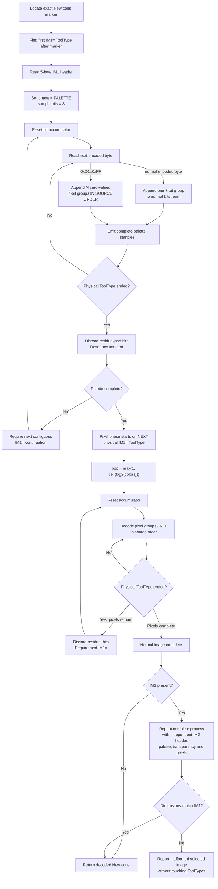

# NewIcons ToolType Encoding and Decoder Semantics for iTidy

## Executive summary

The remaining NewIcons failures are now explainable much more precisely than “we may be flushing at the wrong place.” **The authoritative implementation evidence says the packed bit accumulator must be flushed at every physical `IM1=`/`IM2=` ToolType string boundary, and palette decoding must finish on a ToolType boundary before pixel decoding begins.** AROS implements exactly that behavior, and the independent Deark decoder independently does the same. More importantly, inspection of iTidy's current NewIcons bit reader exposes a second, probably more immediate correctness bug: an RLE token's zero bits are held in a separate `zero_queued` counter and consumed *before* residual bits already present in the normal accumulator. That reverses their order whenever an RLE token follows a 7-bit group that left a partial sample. AROS and Deark both insert the RLE-generated zeros **after** all preceding bits, in normal source order. This matters because the current `Apps.info` and `0016.info` first mismatches occur too early to be caused solely by the end of the first full 123-byte pixel ToolType: `Apps.info` first fails at pixel 207 while a full 123-character line contains at least 287 three-bit pixels, and `0016.info` fails at pixel 23 while such a line contains at least 172 five-bit pixels. The RLE-ordering defect can cause exactly that sort of within-line displacement. fileciteturn0file0 fileciteturn6file0L2-L2 fileciteturn8file0L2-L2 fileciteturn9file0L2-L2 The research therefore changes the recommended fix: **do not merely add a reset at every pixel ToolType boundary. Fix RLE ordering and physical-line resets together, then rerun the real vectors before investigating icon.library remapping further.** I would put high confidence on those two corrections resolving most or all of the NewIcons disagreement; the `0016.info` palette discrepancy may itself turn out to be another consequence of the RLE-ordering bug rather than remapping.

## Evidence and source hierarchy

The strongest historical source I found is the original NewIcons 4.6 distribution from Phil Vedovatti and Eric Sauvageau. The Aminet archive was published on June 23, 1999 and includes the final NewIcons libraries, developer Autodocs, headers and example source. The version history is particularly useful: NewIcons 3.0 changed to library V39.1, offered separate 68000/OS2.x and 68020/OS3.x builds, and states that Børge Nøst rewrote the ToolType decoding routine while keeping things backward compatible; NewIcons 3.1 added developer Autodocs; V4.1 supplied Low-End, Middle-End and High-End library variants. The distribution advertises icons of up to 256 colors and explicitly includes a Low-End library for 68000/OS 2.04. citeturn13search0turn13search1turn18search0

The exact archive is:

`https://aminet.net/package/util/wb/NewIcons46`

A direct Aminet mirror is:

`https://ftp.fau.de/aminet/util/wb/NewIcons46.lha`

Particularly relevant members are:

```text
NewIconsV4/Developers/Autodocs/newicon.doc
NewIconsV4/Developers/Include/libraries/newicon.h
NewIconsV4/Developers/Source/ShowNI/showni.c

NewIconsV4/Libs/LE/newicon.library
NewIconsV4/Libs/ME/newicon.library
NewIconsV4/Libs/HE/newicon.library
```

The original distribution does **not** appear to include the source of `newicon.library` itself; the supplied developer source includes `ShowNI` and DefIconsPrefs rather than the decoder implementation. Thus the original library binaries remain a possible disassembly target if a final historical tie-breaker is ever necessary. citeturn13search1turn26search0

The original project's own surviving support site is also useful. It explains that NewIcons keeps imagery inside otherwise ordinary `.info` ToolTypes, that an icon can retain both its standard fallback image and its NewIcon image, that each NewIcon can have its own palette up to 256 colors, and that the NewIcons library performs reading, remapping and writing. The project's FAQ specifically warns that conventional icon editors can destroy NewIcons imagery and says the NewIcons image ToolTypes are hidden from ordinary ToolType configuration while the NewIcons patch is active. citeturn27search1turn27search3

Original project documentation:

`https://www.amiganet.org/newicons/intro/`

`https://www.amiganet.org/newicons/faq/`

The decisive open-source implementation is AROS:

```text
Repository: aros-development-team/AROS
Path:       workbench/libs/icon/diskobjNIio.c
URL:        https://github.com/aros-development-team/AROS/blob/master/workbench/libs/icon/diskobjNIio.c
```

Its `DecodeNI()` routine says it is based on Dirk Stöcker's `ModifyIcon`, making it useful not just as modern documentation but as executable implementation evidence derived from another Amiga NewIcons implementation. Most importantly, its source directly exposes line resetting, RLE expansion, palette/image separation, header handling, IM2 handling and marker recognition. fileciteturn6file0L2-L2

Deark provides a genuinely independent modern decoder:

```text
Repository: jsummers/deark
Path:       modules/amigaicon.c
URL:        https://github.com/jsummers/deark/blob/master/modules/amigaicon.c
```

Deark deliberately retains each ToolType's terminating NUL when collecting NewIcons data so it can recognize physical boundaries, empties its bit buffer on every NUL, and waits for a line boundary before marking the palette finished and beginning the bitmap. It also implements RLE by feeding the generated zero bits through the **same** bitstream in source order. fileciteturn8file0L2-L2

A further useful independent reader/writer is Iljitsch van Beijnum's Iconverter. Its Aminet package includes its complete `Iconverter/iconverter.c`, and the program can both read and write NewIcons. I have not used its implementation to decide any of the semantics below because I could verify the relevant rules directly in AROS and Deark, but it is an excellent third implementation to add to a future cross-check. citeturn19search3turn19search4

```text
https://main.aminet.net/package/util/conv/Iconverter

Archive member:
Iconverter/iconverter.c
```

The AmigaOS V44+ icon.library Autodocs are important for interpreting your oracle. `GetIconTagList()` distinguishes requesting a palette-mapped icon from remapping that icon for a particular screen: `ICONGETA_GetPaletteMappedIcon` defaults to TRUE, while `ICONGETA_RemapIcon` controls screen remapping. Therefore `ICONGETA_RemapIcon,FALSE` does **not** mean “return the raw NewIcons ToolType representation”; it means do not perform the display remap on the palette-mapped icon. icon.library also explicitly tracks whether a palette-mapped icon originated as NewIcons so it can write it back in NewIcons format. citeturn15search0turn15search4

```text
https://developer.amigaos3.net/autodocs/icon.library/

GetIconTagList mirror:
https://d0.se/autodocs/icon.library/GetIconTagList

IconControlA mirror:
https://d0.se/autodocs/icon.library/IconControlA
```

The evidence hierarchy I would use for iTidy is therefore:

| Priority | Source | What it establishes | Confidence |
|---|---|---|---|
| Highest | Original NewIcons 4.6 distribution and Amiganet project documentation | Supported systems, 256-color design target, version history, library behavior and preservation intent | Very high citeturn13search1turn27search1 |
| Highest for bitstream behavior | AROS `diskobjNIio.c` | Executable NewIcons decoding semantics, including physical-line reset and RLE order | Very high fileciteturn6file0L2-L2 |
| High independent corroboration | Deark `modules/amigaicon.c` | Independently reproduces line flushing, palette boundary and ordered RLE | High fileciteturn8file0L2-L2 |
| High for oracle interpretation | AmigaOS V44+ icon.library Autodocs | Difference between palette-mapped representation and display remapping | Very high citeturn15search0turn15search4 |
| Useful independent implementation | Iconverter `iconverter.c` | Reader/writer suitable for a third cross-check | High provenance; not needed to decide current issue citeturn19search3 |
| Project-specific evidence | iTidy real-vector validator | Shows exactly where current decoder diverges | Very high for these files fileciteturn0file0 |

The resulting implementation comparison is unusually consistent:

| Source | Version | Flush behaviour | Remapping | Notes |
|---|---|---|---|---|
| Original NewIcons | V38.x through V40.x / 4.6 distribution | Decoder source not shipped; V3 decoder was rewritten and stated to remain backward compatible | NewIcons library dynamically remaps icon colors for display | Official design supports up to 256 colors; LE library supported 68000/OS2.04 in V4.1. citeturn13search0turn27search1 |
| AROS icon.library | Current source | **Resets `numbits=0` whenever it moves to another physical `IM1=`/`IM2=` ToolType** | Creates native palette-mapped icon data | RLE zero groups enter normal bitstream order; each image has its own palette/header. fileciteturn6file0L2-L2 |
| Deark | Current source inspected | **Explicitly empties bit buffer on every ToolType NUL** | None; direct file decoder | Marks bitmap start only at a line end after palette is complete; RLE zeros are serial stream bits. fileciteturn8file0L2-L2 |
| AmigaOS icon.library V44+ | OS3.5-era API onward | Internal decoder not public here | Can return palette-mapped data either remapped or not remapped to a screen | `RemapIcon=FALSE` does not mean raw ToolType representation. citeturn15search0turn15search4 |
| iTidy connected `dev-itidy2` snapshot | Current GitHub snapshot inspected | Snapshot still carries residual bits across lines; attached report documents a later local palette-only reset | None in shared decoder | Has a separate `zero_queued` stream that is consumed ahead of normal residual bits. fileciteturn9file0L2-L2 fileciteturn0file0 |

## Authoritative NewIcons semantics

The first major conclusion is now firm: **a ToolType string is a framing boundary, not merely a container around a continuous bitstream.** In AROS, whenever `DecodeNI()` reaches `'\0'` and attaches the next `IM1=` or `IM2=` string, it executes `numbits = 0`. The numeric accumulator itself is not necessarily cleared, but setting its valid-bit count to zero semantically discards all residual bits from the previous string. This happens on every transition to a new ToolType, whether palette or pixels are currently being decoded. fileciteturn6file0L2-L2

Deark reaches the same result independently. It copies the terminating NUL from every source ToolType into a temporary NewIcons stream and, when it encounters that NUL, explicitly sets the bit buffer's valid-bit count to zero. That is unusually strong corroboration because the two implementations organize their decoders quite differently yet make the same framing decision. fileciteturn8file0L2-L2

The second major conclusion concerns RLE. A NewIcons ordinary encoded character contributes one seven-bit group. An RLE byte `0xD1` through `0xFF` contributes respectively 1 through 47 **seven-bit zero groups**. AROS implements an RLE token as the current zero-valued group followed by the indicated additional zero groups; crucially, every zero group goes through the same `bitbuf = (bitbuf << 7) + byte` path that an ordinary group would use. Deark equivalently feeds `7 * (encoded_byte - 0xD0)` zero bits through its normal serial bit-buffer routine. Thus an RLE token is exactly equivalent to inserting zero bits **at that position in source order**. fileciteturn6file0L2-L2 fileciteturn8file0L2-L2

This reveals a concrete defect in the iTidy code that is separate from line flushing. In the connected `shared/icon/icon_newicons.c`, normal residual bits live in `acc`/`nbits`, while RLE zeros are added to `zero_queued`; `ni_get_bit()` checks `zero_queued` first. Consequently, when an RLE byte arrives while `acc` contains a partial sample, iTidy outputs the new zeros **before the older residual bits**. That reverses their stream order. fileciteturn9file0L2-L2

A minimal example makes the problem unambiguous. Consider encoded groups:

```text
0x6F  0xD1
```

`0x6F` maps to seven-bit value `0x4F`:

```text
1001111
```

and `0xD1` contributes seven zeros:

```text
0000000
```

The authoritative logical stream is therefore:

```text
10011110000000
```

At three bits per pixel, the first values are:

```text
100 111 100 000
 4   7   4   0
```

The current separate-zero-queue design instead reaches the third sample with one old `1` bit left in the accumulator and seven newly queued zero bits. Because `zero_queued` wins, it returns `000` rather than `100`, producing:

```text
4, 7, 0, ...
```

This is not a subtle interpretation difference; it is a reordering of the encoded stream. The same two bytes parsed as eight-bit palette samples should begin with `10011110` = `0x9E`; a zero-first queue instead produces seven zeros followed by the old leading bit, `0x01`. The AROS and Deark implementations establish the required source ordering. fileciteturn6file0L2-L2 fileciteturn8file0L2-L2

**Palette and bitmap are separate physical phases.** AROS begins the palette at byte offset `+9` from the ToolType start: four bytes for `IM1=`/`IM2=` plus the five-byte NewIcons header. It removes that physical ToolType from its working list as soon as it starts consuming it. If the palette needs more data, it proceeds to subsequent ToolTypes, resetting the bit count each time. Once the required `colors × 3` RGB bytes have been obtained, the palette decode returns. The pixel decode is then started afresh from the *next remaining physical ToolType*. Therefore pixel samples never begin in unused bits at the tail of the ToolType in which the palette ended. fileciteturn6file0L2-L2

Deark implements the same rule in a different way: it does not mark the palette finished until it reaches a NUL boundary after at least `number_of_colors × 3` decoded bytes, and it records the bitmap start at that point. Its source even notes that the bitmap starts at the beginning of a line. fileciteturn8file0L2-L2

This means the current local compatibility rule reported by iTidy — “single-line encodings still consume leftover bits as pixels” — is not canonical NewIcons behavior. A conventional NewIcons image with pixels requires another `IM1=`/`IM2=` ToolType after the line in which the palette terminates. A one-line palette-plus-pixels synthetic test should therefore not be considered evidence of original-library compatibility. fileciteturn0file0 fileciteturn6file0L2-L2 fileciteturn8file0L2-L2

The five-byte header semantics are equally clear. The header is raw, not passed through the seven-bit encoding:

```text
byte 0   'B' = transparent color enabled
         'C' = no transparent color

byte 1   width  + 0x21
byte 2   height + 0x21

byte 3-4 palette count:
         ((byte3 - 0x21) << 6) + (byte4 - 0x21)
```

AROS sets transparent color to palette index 0 when the first byte is `B`; otherwise it reports no transparent color. Each `IM2` image is parsed from its own header and gets its **own palette, palette count and transparency field**. AROS additionally checks that selected-image dimensions agree with the normal image. Your real `Apps.info` is direct real-world evidence that palettes are independent: its normal image uses 8 colors while its selected image uses 9. fileciteturn6file0L2-L2 fileciteturn0file0

The effective bits per pixel should follow the original compatible implementation as:

```text
bpp = max(1, ceil(log2(number_of_colors)))
```

AROS starts the calculation at one bit. Thus 2 colors need 1 bit, 3–4 need 2, 5–8 need 3, 9–16 need 4, 17–32 need 5, 33–64 need 6, 65–128 need 7, 129–256 need 8, and a compatibility 257-color stream uses 9. The iTidy connected source currently returns zero bits for a one-color palette and cannot read more than eight pixel bits, so a one-color or 257-color NewIcons sample would diverge from AROS even apart from today's test files. fileciteturn6file0L2-L2 fileciteturn9file0L2-L2

The official NewIcons project describes 256 colors as the supported design maximum, but the count encoding itself has no special “256” sentinel. Therefore these counts encode directly as:

| Palette entries | Header high byte | Header low byte | Pixel bpp |
|---:|---:|---:|---:|
| 255 | `0x24` | `0x60` | 8 |
| 256 | `0x25` | `0x21` | 8 |
| 257 | `0x25` | `0x22` | 9 |

The original project advertises up to 256 colors. However, because your existing format research records real 257-entry files, I would treat 257 as a **compatibility anomaly**, not redefine it as canonical NewIcons. Deark is instructive here: it permits palettes larger than 256 while decoding but detects whether a greater-than-255 pixel index is actually used, because its final indexed output cannot represent such a value. AROS likewise does not enforce a 256-entry palette limit before calculating the pixel bit width. citeturn18search0turn27search1 fileciteturn8file0L2-L2 fileciteturn6file0L2-L2

For iTidy I would therefore implement the 257 case as follows: accept `palette_count == 257`, decode the complete 257-entry palette and parse pixel values temporarily into at least a 16-bit value using 9 bits per sample. If every referenced index is `0..255`, safely down-convert the pixels to iTidy's current eight-bit indexed representation while retaining or recording the source palette count. If a pixel actually references 256, return an explicit unsupported-large-index error rather than silently truncating it. I would not automatically generalize this to arbitrary 258–4095-color values without a real corpus demonstrating that such files existed.

Finally, physical NewIcons data is marker-delimited. AROS first searches for the exact ToolType:

```text
*** DON'T EDIT THE FOLLOWING LINES!! ***
```

and only then searches for NewIcons imagery. Once decoding an image set has started, continuation lines are expected to be successive `IM1=` or successive `IM2=` strings. AROS can scan forward to locate the start of IM2, but a foreign ToolType inserted halfway through an IM1 continuation stream would terminate that stream as malformed. fileciteturn6file0L2-L2

That differs from the connected iTidy source, whose `collect_lines()` currently searches the entire ToolType array and gathers every `IM1=` or `IM2=` string regardless of the marker and regardless of whether matching lines are physically contiguous. For a utility whose central goal is **not corrupting application ToolTypes**, that should eventually be tightened: only a recognized NewIcons region should be treated as image data. fileciteturn9file0L2-L2

## Forensic analysis of `Apps.info` and `0016.info`

The real-vector validation has already established several exact facts. `TestsIcons/test-icons/Newicons/Apps.info` is 36×40, transparent through index 0, with 8 colors in its normal image and 9 in selected. `0016.info` is 42×42 with 32-color normal and selected images and transparency at index 0. Both decode without structural failure; both fail the icon.library pixel oracle and the RGB-composite oracle. fileciteturn0file0

From those values and the authoritative header formula, we can reconstruct the headers exactly:

```text
Apps.info normal

49 4D 31 3D 42 45 49 21 29
 I  M  1  =  B  E  I  !  )

IM1=BEI!)
```

Here `E - 0x21 = 36`, `I - 0x21 = 40`, and `! )` encodes 8 colors.

```text
Apps.info selected

49 4D 32 3D 42 45 49 21 2A
 I  M  2  =  B  E  I  !  *

IM2=BEI!*
```

The selected palette count of 9 therefore has its own independent header.

For `0016.info`:

```text
49 4D 31 3D 42 4B 4B 21 41
 I  M  1  =  B  K  K  !  A

IM1=BKK!A
```

and its selected header is correspondingly:

```text
IM2=BKK!A
```

because both images are 42×42 and both use 32 colors. These byte sequences follow directly from the dimensions, palette counts and transparency reported by your validator and the header arithmetic used by AROS. fileciteturn0file0 fileciteturn6file0L2-L2

The report gives exact first-line sizes for normal imagery:

```text
Apps.info IM1[0]:

"IM1="       4 bytes
header       5 bytes
encoded     27 bytes
--------------------
strlen      36 bytes
```

so its physical first line has this form:

```text
49 4D 31 3D 42 45 49 21 29 [27 encoded palette/pad bytes]
```

For `0016.info`:

```text
"IM1="        4 bytes
header        5 bytes
encoded     110 bytes
---------------------
strlen       119 bytes
```

or:

```text
49 4D 31 3D 42 4B 4B 21 41 [110 encoded palette/pad bytes]
```

The report records 224 decompressed logical bits on the Apps first line versus 192 palette bits required, leaving 32 padding bits, and 784 bits on the `0016` first line versus 768 required, leaving 16. The fact that the decoded bit counts exceed `27×7 = 189` and `110×7 = 770` also proves that RLE expansion occurs somewhere on each of those physical lines. fileciteturn0file0

I cannot honestly print the remaining 27 and 110 raw encoded bytes because the two `.info` binaries themselves are not attached to this chat, and the connected `dev-itidy2` GitHub snapshot does not expose them at the reported test path. The validation report contains lengths, decoded bit totals, CRCs and mismatch coordinates but not literal ToolType payload dumps. Inventing those bytes would undermine the purpose of this research. The next validator run should therefore print the payload hex—or at minimum each RLE token's line-relative offset—so the exact RLE point can be correlated with the first divergence.

The hypotheses can nevertheless be separated much further than before:

| Decoder hypothesis | What happens at ToolType boundary | What happens to RLE | Evidence/result |
|---|---|---|---|
| Carry everything | Residual sample bits continue into next ToolType | Existing iTidy queue behavior | **Known wrong.** Before palette flush, CRCs were Apps `6C34D7C1/A117D9A5`; 0016 `5D6EDB83/46B6B7E5`. fileciteturn0file0 |
| Palette-line flush only | Palette tail discarded, pixel lines remain continuous | Existing queue behavior | **Current tested state.** Apps `AFFA4641/F914E881`, first RGB mismatches 207/376. 0016 `E88DAA8C/49ACFE9B`, first mismatches 23/15. fileciteturn0file0 |
| Flush every ToolType but retain zero-priority queue | Correct physical framing | **Still reorders RLE relative to residual bits** | Predicted still wrong wherever an RLE token arrives with residual accumulator bits. This variant is useful only as an isolation test. fileciteturn9file0L2-L2 |
| Flush every ToolType and serialize RLE normally | Correct physical framing | Zero groups appear exactly at source position | **Authoritative target behavior**, matching AROS and Deark. fileciteturn6file0L2-L2 fileciteturn8file0L2-L2 |

There is a particularly important forensic deduction here. Your report says later normal `IM1=` strings are 127 characters long, therefore a full pixel continuation contains 123 encoded characters after the four-byte prefix. An ordinary encoded character contributes seven bits; an RLE character contributes **at least** seven bits and potentially more. Thus a full pixel ToolType represents **at least 861 logical bits**. fileciteturn0file0

For `Apps.info` normal, eight colors mean 3 bits per pixel:

```text
123 × 7 = 861 bits minimum
861 / 3 = 287 complete pixels minimum
```

Yet the first observed normal-image mismatch is:

```text
pixel 207
x=27, y=5
shared: index 0, transparent
oracle: index 6, opaque
```

That is **80 pixels before the earliest possible end of a full first pixel ToolType**. Therefore the Apps normal mismatch cannot be caused solely by carrying residual bits from the end of that first pixel ToolType. fileciteturn0file0

For `0016.info`, 32 colors mean 5 bits per pixel:

```text
861 / 5 = 172 complete pixels minimum
```

but the first normal mismatch is:

```text
pixel 23
x=23, y=0
shared: index 0, transparent
oracle: index 30, opaque
```

and selected fails even earlier at pixel 15. Those errors also occur far too early to be explained by crossing a full 123-character pixel ToolType boundary. fileciteturn0file0

This is the strongest new finding of the research. **Per-line flushing is certainly required, but it is not sufficient to explain the currently observed first mismatches.** Something is already going wrong *inside* a pixel line. The identified RLE-ordering defect is exactly such a mechanism.

The Apps case also gives us a useful control. Its normal and selected palettes exactly match icon.library, while its pixels do not. That means the basic header, ordinary seven-bit decoding and palette ordering work for that file. Its reported first-line RLE run lies in palette padding, so resetting after the palette protects the palette from that RLE. The pixel stream, however, can encounter RLE with a partial three- or four-bit sample outstanding, where the separate-zero-queue ordering becomes significant. fileciteturn0file0

`0016.info` is even more interesting. Its first palette line contains an RLE expansion somewhere—the 110 encoded characters represent 784 bits rather than the uncompressed 770—and its palette differs from icon.library. Until we know the raw RLE offset, there are two possibilities. If the RLE token occurs before the first 768 palette bits have been produced, iTidy's zero-priority queue can directly corrupt palette bytes and may completely explain the palette mismatch. If it lies wholly in the final 16 bits of padding, then the stored iTidy palette should remain correct and the icon.library representation becomes the next question. fileciteturn0file0

That gives the validator one extremely useful new diagnostic for `0016.info`: print each RLE token as:

```text
IM1 line=<n>
source_offset=<n>
token=0xD1..0xFF
logical_bit_position_before_token=<n>
residual_bits_before_token=<n>
phase=palette|pixels
```

If the first-line RLE occurs with `logical_bit_position < 768`, the current palette CRC `DAD2D1EE` should be considered suspect until the RLE-order fix is applied.

The current known CRCs should therefore be retained as **known-bad fingerprints**, not promoted to final regression targets:

| Vector | Pre-palette-fix pixels N/S | Current palette-flush pixels N/S | Current palette CRC |
|---|---|---|---|
| `Apps.info` | `6C34D7C1` / `A117D9A5` | `AFFA4641` / `F914E881` | `C7DCC148` |
| `0016.info` | `5D6EDB83` / `46B6B7E5` | `E88DAA8C` / `49ACFE9B` | `DAD2D1EE` |

fileciteturn0file0

The **correct post-RLE/post-line-reset pixel CRCs are not present in the existing report**, because that implementation has not yet been run. They should not be guessed. The next validator should print both shared and oracle CRCs so the successful results can replace these known-bad fingerprints as permanent canonical vectors.

## icon.library behavior and safe ToolType preservation

The RGB-composite extension to the validator was valuable because it proved that today's mismatches are not merely palette-index permutation. On both NewIcons vectors the rendered semantic RGB differs from the icon.library result, including transparent-versus-opaque differences. That makes the current shared decode wrong regardless of how icon.library internally represents its palette. fileciteturn0file0

There is nevertheless an important distinction to preserve in future comparisons. AmigaOS V44+ `GetIconTagList()` has two separate concepts: requesting a **palette-mapped icon** and remapping that icon's palette to a screen. `ICONGETA_GetPaletteMappedIcon` defaults to TRUE; `ICONGETA_RemapIcon` controls the latter display remapping. Therefore:

```text
ICONGETA_RemapIcon = FALSE
```

means:

```text
give me the palette-mapped icon without remapping it to the screen
```

not:

```text
give me the exact raw NewIcons palette/index stream as serialized
```

The API also records whether an icon originated in NewIcons format and has an option controlling whether such icons are written back in NewIcons format. That confirms icon.library maintains a higher-level native representation rather than simply handing callers the ToolType bitstream. citeturn15search0turn15search4

Accordingly, the three useful oracle levels for iTidy are:

| Oracle | Question answered |
|---|---|
| Direct AROS/Deark-style decoding | “Did we interpret the raw NewIcons stream correctly?” |
| Original `newicon.library` | “Would the historical NewIcons runtime interpret this file the same way?” |
| icon.library V44+ RGB comparison | “Would a later AmigaOS/icon.library display the same normal and selected image?” |

The final iTidy decoder should ideally satisfy all three, but **RGB equality is the more meaningful criterion than raw index equality when comparing against V44+ icon.library**. Official icon.library documentation explicitly permits palette-mapped icons to be remapped and warns callers that palette-mapped imagery can change when screen mapping changes. citeturn15search0turn15search1

For iTidy's stated goal, preserving ToolTypes is just as important as decoding the pixels. The original NewIcons design deliberately embedded its image data among ToolTypes while allowing the classic icon image to coexist, and the NewIcons project explicitly describes the NewIcons ToolTypes as hidden from ordinary application configuration. citeturn27search1turn27search3

The safe iTidy rule should therefore be:

> **Decoding an icon must never mutate its ToolTypes. Updating the classic normal/selected imagery must never rewrite its ToolTypes.**

That is deliberately stricter than AROS's in-memory decoder. AROS locates the marker, writes a NUL into its working ToolType pointer array at the marker, and removes NewIcons ToolTypes from that working array as it decodes. That is convenient inside icon.library because it hides private NewIcons data from callers, but it is emphatically **not** the pattern iTidy should use when preserving an on-disk file. fileciteturn6file0L2-L2

For iTidy, I recommend treating the raw ToolType array as immutable input and creating lightweight views describing:

```text
application ToolTypes
marker
IM1 block
IM2 block
other preserved ToolTypes
```

When iTidy merely adapts the classic Workbench image for WB2.x/3.x, **all ToolTypes should be written back exactly as read, in the same order and with the same strings**. That lets a single `.info` retain:

```text
classic fallback
        +
NewIcons normal image
        +
NewIcons selected image
        +
application configuration ToolTypes
```

and means a WB2.x machine without NewIcons can use iTidy's adapted classic fallback while a NewIcons-aware system can continue to use the original enhanced image. This is exactly the compatibility advantage the original NewIcons designers intended by retaining the standard icon imagery alongside NewIcons data. citeturn27search1

If iTidy later gains a feature that *rewrites* NewIcons rather than merely reading them, it should identify ownership structurally: require the exact marker, then replace only the specific contiguous `IM1=` and `IM2=` image sequences recognized beneath it. It should not perform a global “delete all ToolTypes beginning `IM1=`” operation. AROS's source shows why: NewIcons recognition is marker-relative, not a search over every ToolType in the file. fileciteturn6file0L2-L2

This suggests one additional hardening fix beyond the immediate mismatch: change the shared NewIcons scanner from the current “collect every matching prefix anywhere” approach to a marker-aware state machine. The connected implementation currently gathers every `IM1=` and every `IM2=` regardless of context; that is more permissive than the established decoder and creates unnecessary risk around unrelated application ToolTypes. fileciteturn9file0L2-L2

There is also one historical NewIcons feature worth recording for the eventual “read everything seen on WB2.x–3.x” goal: **`DEFAULTIMAGE=`**. The NewIcons project documents icons containing no embedded NewIcons imagery but instead using `DEFAULTIMAGE=path` to obtain imagery from another icon. That is not part of the `IM1`/`IM2` bitstream decoder, but it means “NewIcons-compatible appearance” is not universally synonymous with “this `.info` contains IM1.” A future scanner can classify this separately and, if desired, resolve it with loop/depth protection. citeturn18search0turn27search3

The format itself appears stable across the main NewIcons generations. The V3.0 release explicitly says the ToolType decoder was rewritten and that the new library remained fully backward compatible; later V4 changes described in the original history concern runtime libraries, palettes, preferences, transparency/border options and tools rather than introducing an on-disk format version. There is no version field in the five-byte image header. It is therefore reasonable to implement one canonical NewIcons stream decoder plus carefully documented historical-tolerance rules rather than separate V2/V3/V4 decoders. This is an inference from the original release history and the unversioned decoder structure. citeturn13search0turn18search0

## Actionable decoder specification

The following is the decoder contract I would now give the coding agent.

**Recognition.** Preserve the complete ToolType table unchanged. Search for the exact NewIcons marker:

```text
*** DON'T EDIT THE FOLLOWING LINES!! ***
```

Only treat `IM1=`/`IM2=` records after that marker as canonical NewIcons image records. Do not globally aggregate same-prefix strings from unrelated positions. Within an image continuation, require physical continuity exactly as the historical decoder does. fileciteturn6file0L2-L2

**Header.** The first physical ToolType of each image set starts:

```text
IM1=<five-byte-header>...
```

or:

```text
IM2=<five-byte-header>...
```

Interpret:

```text
transparent = header[0] == 'B'
width       = header[1] - 0x21
height      = header[2] - 0x21
colors      = ((header[3] - 0x21) << 6)
            +  (header[4] - 0x21)
```

Require sensible nonzero dimensions. Retain the established NewIcons 93×93 canonical limit for compatibility with old implementations; the original NewIcons project specifically warned that the 93×93 restriction was inherited from the original design and that larger images could crash older software. citeturn27search3

**Encoded characters.** Canonical output uses:

```text
0x20..0x6F -> seven-bit value 0x00..0x4F
0xA1..0xD0 -> seven-bit value 0x50..0x7F
0xD1..0xFF -> (c - 0xD0) seven-bit groups of zero
```

For the normal case, treat any other encoded byte as malformed. AROS itself is somewhat more permissive in the byte ranges it accepts; that can be added later as an explicitly labelled “AROS compatibility” tolerance if a real icon requires it, rather than weakening the canonical parser by default. The core stream and RLE interpretation above are directly evident in AROS and Deark. fileciteturn6file0L2-L2 fileciteturn8file0L2-L2

**RLE.** Do not keep RLE-generated zero bits in an independent higher-priority queue. Conceptually convert an RLE byte into N ordinary zero-valued seven-bit groups and process those groups through exactly the same accumulator as an ordinary encoded character:

```text
for each 7-bit group in source order:
    bitbuf = (bitbuf << 7) | group
    nbits += 7

    while nbits >= sample_bits and more outputs are required:
        sample = (bitbuf >> (nbits - sample_bits)) & mask
        nbits -= sample_bits
        emit sample
```

This guarantees that an RLE run following residual ordinary bits remains **after** those bits rather than overtaking them. fileciteturn6file0L2-L2

**Physical line boundary.** At every ToolType NUL/end-of-string:

```text
discard all residual bits
bitbuf = 0
nbits = 0
```

Do this regardless of whether the current phase is palette or pixels. Padding belongs to the physical string on which it occurs and is never consumed by the following ToolType. fileciteturn6file0L2-L2 fileciteturn8file0L2-L2

**Palette.** Begin the first palette bitstream immediately after the five-byte header and decode RGB components as eight-bit samples in R,G,B order. If the palette is not complete by the end of a physical ToolType, flush residual bits and continue palette decoding from the next contiguous same-image ToolType with a new bit accumulator. When the required `colors × 3` bytes are reached, finish the **entire current physical line** conceptually: any remaining bits/characters on that line are padding, not pixel data. Pixel decoding begins with a clean accumulator at the next physical same-image ToolType. fileciteturn6file0L2-L2 fileciteturn8file0L2-L2

**Pixels.** Compute:

```text
bpp = max(1, ceil(log2(colors)))
```

Decode exactly `width × height` chunky palette indexes. At each physical continuation boundary, discard residual pad bits and restart the bit accumulator. Reject an index outside the declared palette. fileciteturn6file0L2-L2

**Transparency.** `B` makes palette index 0 transparent; `C` means there is no transparent palette index. RGB stored behind a transparent pixel is semantically irrelevant during rendered-image comparison. Do not infer “frameless” or “no border” from transparency: the original NewIcons V4 work explicitly separated transparent and no-border options. fileciteturn6file0L2-L2 citeturn13search0

**Selected imagery.** `IM2` is not a delta, overlay, shared-palette image or mere highlight flag. Decode it as a complete independent NewIcons image with its own header, color count, palette, transparency and pixel stream. Require dimensions to agree with the normal image for historical compatibility. Your Apps vector's 8-color normal and 9-color selected palettes are a useful permanent regression test for this rule. fileciteturn6file0L2-L2 fileciteturn0file0

**257-entry compatibility.** Treat 1–256 as canonical. Additionally accept exactly 257 as a compatibility case, use nine-bit pixel samples, and parse samples through a wider temporary integer. Permit conversion to the current `UBYTE` indexed representation only if every actually referenced pixel is ≤255. Do not silently truncate pixel value 256. Deark's handling gives good precedent for this defensive approach. fileciteturn8file0L2-L2

The resulting decision flow is:



That flow follows the AROS physical-line reset and image handling and the independent Deark line-boundary implementation. fileciteturn6file0L2-L2 fileciteturn8file0L2-L2

## Patch and regression plan

The immediate patch should remain small. I would not rewrite the whole NewIcons subsystem now that the research has isolated two concrete problems.

| Change | Why | Scope |
|---|---|---|
| Replace/rework `zero_queued` so RLE zero groups are inserted after existing residual bits | Fixes a real source-order violation and is the leading explanation for early within-line mismatches | `shared/icon/icon_newicons.c` only |
| Reset `acc`, `nbits` and any RLE state at **every** physical IM1/IM2 boundary | Required by both AROS and Deark | Same file |
| Always start pixels on the physical line following palette completion | Matches AROS and Deark; removes noncanonical same-line behavior | Same file |
| Change bpp to a minimum of one bit | Matches AROS edge behavior | Same file |
| Keep ColorIcon/GlowIcon/classic code untouched | Their real-vector validation is already clean | No change |
| Then harden scanner around marker/contiguity | Protects unrelated ToolTypes; not necessary to diagnose today's pixel shift but important before iTidy writes icons | Small follow-up |

The first code change should conceptually remove this split:

```text
normal bits  ---> acc
RLE zeros    ---> separate priority queue
```

and replace it with:

```text
normal group ----\
                  >---- one ordered logical bitstream ----> samples
RLE zero group --/
```

No special RLE “carry state” is required across ToolTypes. A source RLE token should be expanded atomically/in-order; after the physical ToolType ends, whatever incomplete sample residue remains is padding and is discarded. That is what both inspected independent implementations do. fileciteturn6file0L2-L2 fileciteturn8file0L2-L2

Before the real files are rerun, I would add two tiny byte-level unit tests because they expose the exact two bugs without relying on a full `.info`.

**RLE-order test:**

```text
Encoded source:
    6F D1

Expanded bits:
    1001111 0000000

For bpp = 3, expected first samples:
    4, 7, 4, 0

Critical assertion:
    sample[2] == 4
```

The old zero-priority queue yields `0` at that critical position.

An eight-bit variant is even more sensitive:

```text
Encoded source:
    6F D1

First authoritative 8-bit sample:
    10011110 = 0x9E

Assertion:
    first_byte == 0x9E
```

A zero-first queue can instead produce `0x01`.

**Physical-boundary test:**

```text
Line 1:
    6F      -> 1001111

Line 2:
    20      -> 0000000

bpp = 3
```

A decoder that correctly flushes the one residual bit at the end of line 1 yields:

```text
line 1: 100 111 [1 discarded]
        4   7

line 2: 000 000 [0 discarded]
        0   0

expected:
    4, 7, 0, 0
```

A continuous-stream decoder incorrectly uses the trailing `1` from line 1 to begin the next sample and can produce:

```text
4, 7, 4, 0, ...
```

Those two microscopic tests independently prove RLE ordering and ToolType flushing and should stay permanently in the suite.

For the real vectors, retain these exact structural assertions:

```text
TestsIcons/test-icons/Newicons/Apps.info

normal header:
    IM1=BEI!)
    49 4D 31 3D 42 45 49 21 29

expected:
    width                36
    height               40
    normal palette       8
    normal transparent   0
    selected palette     9
    selected transparent 0
```

and:

```text
TestsIcons/test-icons/Newicons/0016.info

normal header:
    IM1=BKK!A
    49 4D 31 3D 42 4B 4B 21 41

expected:
    width                42
    height               42
    normal palette       32
    selected palette     32
    normal transparent   0
    selected transparent 0
```

These dimensions, palette counts and transparency values are already confirmed by the shared decoder and icon.library oracle. fileciteturn0file0

The current CRCs should be asserted only in a **known-bad migration test** or recorded in the hand-off so that we know the decoder actually changed:

```text
Apps.info current known-bad:
    normal pixels      AFFA4641
    selected pixels    F914E881
    normal palette     C7DCC148

0016.info current known-bad:
    normal pixels      E88DAA8C
    selected pixels    49ACFE9B
    normal palette     DAD2D1EE
```

After the authoritative fix, at least the pixel CRCs are expected to change. `Apps.info`'s palette CRC should probably remain `C7DCC148`, because it already agrees with icon.library. Whether `0016.info`'s `DAD2D1EE` remains valid depends on where the first-line RLE token occurs; that should be settled by the new RLE-offset diagnostic rather than guessed. fileciteturn0file0

The Amiga acceptance run should then remain:

```text
Bin/Amiga/iTidy2/iTidyIconTest TestsIcons/test-icons COMPARE
```

The strongest desired outcome is:

```text
Decode failures:            0

ColorIcon/GlowIcon:
    10 index matches
    10 RGB matches

NewIcons:
    Apps.info RGB match normal + selected
    0016.info RGB match normal + selected

Classic:
    17 intentionally skipped from palette oracle

RGB mismatches:
    0

Invalid palette indexes:
    0
```

If the fixed NewIcons decoder reaches RGB equality but `0016.info` still differs in raw palette/index ordering, **do not change the decoder just to force index equality**. At that point the official V44 API's palette-mapped representation becomes a plausible explanation, and the correct next comparison would be the raw NewIcons result against AROS, Deark and ideally the historical `newicon.library`. The V44 API documentation makes clear that an un-remapped palette-mapped icon is still a higher-level icon.library representation, not a promise of serialized ToolType identity. citeturn15search0turn15search4

Conversely, if RGB still fails after both ordered-RLE and per-ToolType flushing, the validator should report the first mismatch together with the most recent RLE token, physical ToolType number, source-byte offset and accumulator state. That would let the remaining discrepancy be traced byte-for-byte rather than inferred from an image.

The key expected outcomes after this research are therefore:

```text
Current understanding
=====================

Palette boundary flush only
        NOT SUFFICIENT

Every ToolType boundary flush
        REQUIRED

RLE zero runs in separate priority queue
        WRONG

RLE zero runs inserted in source order
        REQUIRED

Pixels sharing palette's final ToolType
        NONCANONICAL

IM2 sharing IM1 palette
        WRONG

IM2 independent palette/header
        REQUIRED

255 colors
        canonical, 8 bpp

256 colors
        canonical, 8 bpp

257 colors
        compatibility anomaly, 9 bpp;
        accept only with safe wide intermediate handling

Global search for every IM1=/IM2=
        TOO PERMISSIVE FOR ITIDY

Marker-aware, contiguous image parsing
        SAFER AND CLOSER TO HISTORICAL BEHAVIOR

Modifying classic fallback
        MUST NOT ALTER TOOLTYPES
```

The deep-research result is therefore stronger than merely confirming the existing specification. **It confirms the per-string flush rule, but it also identifies an independent RLE ordering bug that the existing specification and validation discussion had missed.** Given the observed mismatch positions, I would fix the ordered RLE stream and physical ToolType framing together before doing any further investigation of palette remapping. The evidence from AROS, Deark, the original NewIcons package and your own real-vector results all points in the same direction. fileciteturn6file0L2-L2 fileciteturn8file0L2-L2 citeturn13search0 fileciteturn0file0